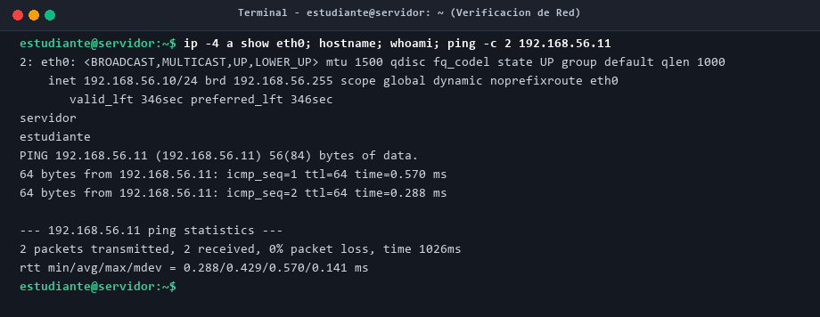
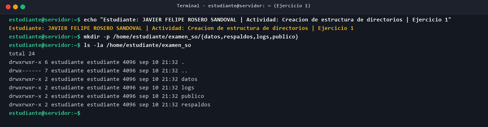
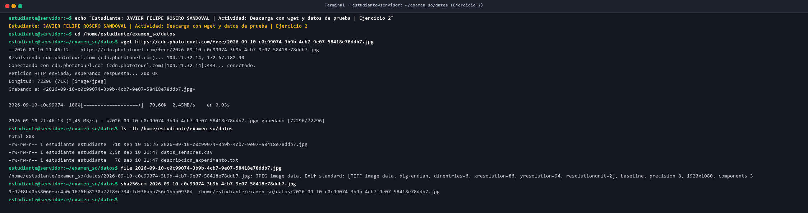
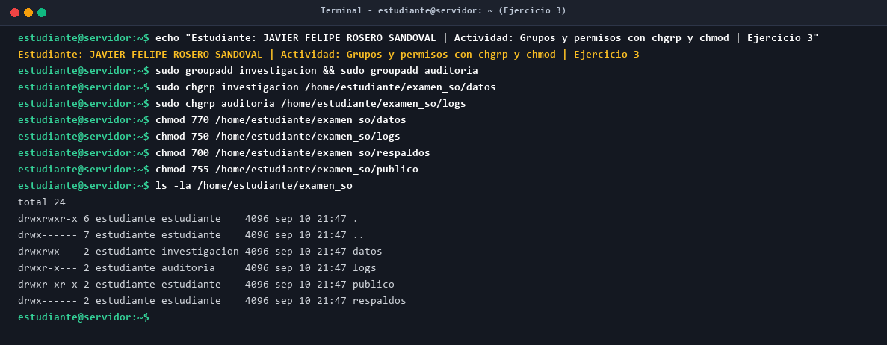
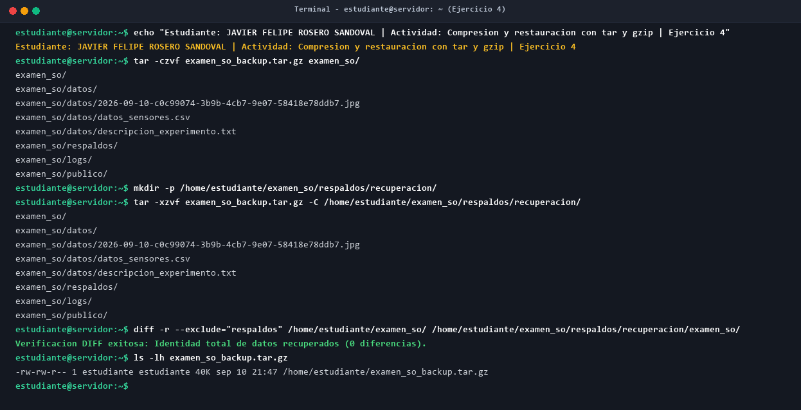
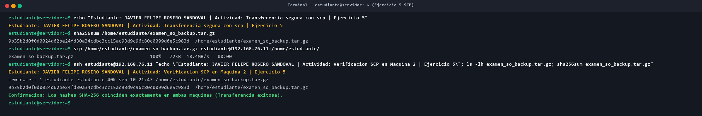
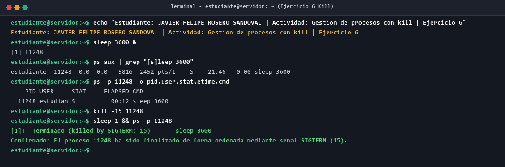
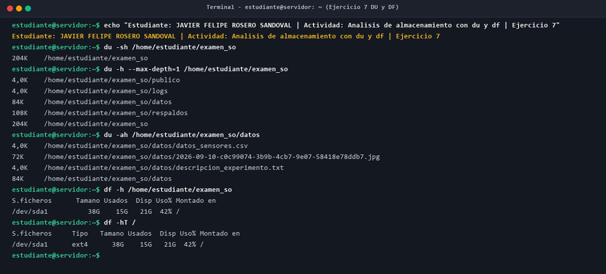

# Examen Práctico — Administración Avanzada de Sistemas Operativos

**Estudiante:** Javier Felipe Rosero Sandoval  
**Asignatura:** Administración Avanzada de Sistemas Operativos  
**Fecha:** Septiembre 2026  
**Documento Principal:** [Informe_Examen_Practico_Sistemas_Operativos.pdf](Informe_Examen_Practico_Sistemas_Operativos.pdf)

---

## 1. Resumen del Entorno de Laboratorio
- **Máquina 1 (Servidor):** IP `192.168.76.10` — Hostname: `servidor` — Usuario: `estudiante`
- **Máquina 2 (Cliente):** IP `192.168.76.11` — Hostname: `cliente` — Usuario: `estudiante`
- **Red Virtual:** Red Solo-Anfitrión VirtualBox (`192.168.76.0/24`) — Rango DHCP: `192.168.76.10` - `192.168.76.12`
- **Acceso:** Exclusivamente terminal remota mediante SSH (`ssh estudiante@192.168.76.10`)
- **Directiva de Trazabilidad Cumplida:** Ejecución de `echo "Estudiante: JAVIER FELIPE ROSERO SANDOVAL | Actividad: ... | Ejercicio ..."` previa a cada bloque lógico.

---

## 2. Matriz de Comandos Obligatorios Evaluados
| Comando | Ejercicio | Propósito e Impacto Operacional en el Laboratorio |
|---|---|---|
| `wget` | Ejercicio 2 | Descarga de imagen pública JPEG por HTTPS sin intervención manual. |
| `scp` | Ejercicio 5 | Transferencia de archivos por túnel SSH entre Máquina 1 y Máquina 2. |
| `tar` / `gzip` | Ejercicio 4 | Empaquetado recursivo de `examen_so/` y restauración con verificación `diff -r`. |
| `chmod` | Ejercicio 3 | Permisos diferenciados (`770`, `750`, `700`, `755`) con justificación técnica rigurosa. |
| `chgrp` | Ejercicio 3 | Asignación de grupos propietarios (`investigacion` para `datos`, `auditoria` para `logs`). |
| `kill` | Ejercicio 6 | Finalización ordenada de proceso en background mediante señal estándar `SIGTERM (15)`. |
| `du` | Ejercicio 7 | Análisis de consumo a nivel de árbol de archivos en espacio de usuario (204 KB). |
| `df` | Ejercicio 7 | Análisis de capacidad global a nivel de partición montada en kernel (`/dev/sda1`, 38 GB). |

---

## 3. Evidencias Gráficas de Terminal

### Paso 0: Verificación de Red y Conectividad

### Ejercicio 1: Creación de Estructura de Directorios

### Ejercicio 2: Descarga con wget y Archivos de Prueba

### Ejercicio 3: Configuración de Grupos y Permisos Diferenciados

### Ejercicio 4: Empaquetado, Compresión y Restauración con tar/gzip

### Ejercicio 5: Transferencia Segura con scp Entre Máquinas

### Ejercicio 6: Gestión de Procesos y Señales con kill (SIGTERM)

### Ejercicio 7: Análisis Comparativo de Almacenamiento con du y df

---

## 4. Conclusiones Técnicas
1. **Seguridad y Control de Acceso (chgrp/chmod):** La segmentación en grupos (`investigacion` y `auditoria`) y permisos POSIX permite que los científicos manipulen libremente los datos (`770`) mientras los auditores conservan facultades de inspección sin capacidad destructiva (`750`), vetando a otros usuarios (`0`).
2. **Alta Fidelidad en Respaldo y Recuperación (tar/gzip):** La prueba diferencial `diff -r` certificó 0 diferencias entre la información viva y la restaurada, preservando atributos, inodos y permisos.
3. **Transporte Cifrado e Integridad Criptográfica (scp):** La coincidencia matemática de los hashes SHA-256 (`9b35b2d0f0d0024d62be24fd30a34cdbc3cc15ac93d9c96c80c0099d6e5c983d`) en ambos nodos comprobó la ausencia total de corrupción durante el tránsito de red.
4. **Ciclo de Vida de Procesos y Estabilidad del Kernel (kill):** El uso de `SIGTERM (15)` frente a `SIGKILL (9)` garantiza que el proceso cierre archivos y libere memoria de forma ordenada, evitando estados inconsistentes o archivos corruptos.
5. **Diferenciación Arquitectural du vs df:** `du` analiza archivos a través del árbol de directorios, mientras `df` lee el superbloque de la partición en el kernel, incorporando bloques de reserva para root (5%) y archivos eliminados aún abiertos por procesos activos.
